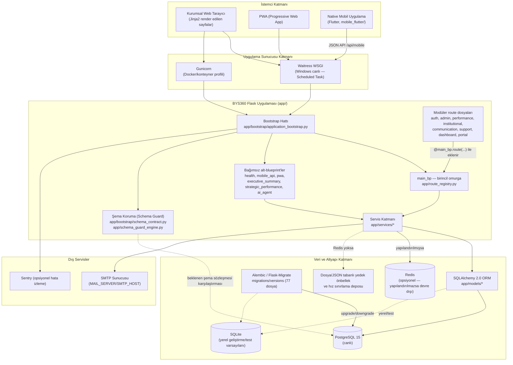

Doküman Adı: BYS360 Sistem Mimarisi ve Teknik Tasarım
Doküman Türü: Teknik / Mimari
Kurum: Çanakkale Savaşları Gelibolu Tarihi Alan Başkanlığı
Sürüm: Current-State 1.0
Tarih: 2026-09-02
Durum: Puantaj Öncesi Mevcut Durum Dokümanı
Kaynak Kod Referansı: 873e6d3348e644c5384a33a99c517600a3346cfd
Uzak CI Referansı: 7d73ff4d468cad11d78d2339ba770f70b5ec0baf (uzaktan doğrulanmış tarihsel/mevcut kontrol noktası, yerel HEAD değil)
Son Güncelleme: 2026-09-02

---

## 1. Kapsam ve amaç

Bu doküman, BYS360 sisteminin **Puantaj (personel devam/mesai) geliştirmesi başlamadan önceki**, kaynak koddan doğrudan doğrulanmış mimari görünümünü tarif eder. Doküman kod inceleme sonucudur; pazarlama amacı taşımaz ve iddiaları kanıt sınıfına göre etiketler: `CODE_VERIFIED` (kod doğrudan okundu), `SCRIPT_VERIFIED` (release/ops betiği okundu), `DOCUMENTATION_DERIVED` (mevcut belgeden alınmış, bu incelemede bağımsız doğrulanmamış), `NOT_YET_FINALIZED` (bu aşamada netleştirilmemiş).

## 2. Genel mimari yaklaşım

BYS360, **Python/Flask üzerinde çalışan, sunucu taraflı (server-rendered) tek bir Flask uygulaması** olarak tasarlanmıştır (`CODE_VERIFIED` — `app/__init__.py`, `app/bootstrap/application_bootstrap.py`). Kullanıcı arayüzü Jinja2 şablonlarıyla sunucuda üretilir; ayrıca bir PWA (Progressive Web App) katmanı ve JSON tabanlı bir mobil API katmanı (native Flutter uygulaması için) aynı uygulama süreci içinde barınır. Sistem klasik anlamda mikroservis mimarisi değildir — **tek bir Flask uygulama fabrikası, tek bir birincil URL omurgası, tek bir PostgreSQL/SQLite veritabanı** üzerine kuruludur.

Üç istemci yüzeyi vardır:

1. **Kurumsal web arayüzü** — Jinja2 şablonlarıyla sunucuda render edilen tam sayfalar (personel, yönetici, üst yönetim rolleri).
2. **PWA (Progressive Web App)** katmanı — `app/pwa/`, `app/pwa_routes.py`, `app/pwa_blueprint.py` (service worker/manifest desteği).
3. **Native mobil uygulama (Flutter)** — `mobile_flutter/bys360_mobile_native/` altında ayrı bir Flutter projesi; sunucudaki `app/api/mobile/` altındaki JSON API'ler üzerinden veri alışverişi yapar (bkz. §7).

## 3. Uygulama fabrikası ve başlangıç (bootstrap) hattı

Uygulama girişi `app/__init__.py` içindeki `create_app` sözleşmesidir; gerçek kurulum işi `app/bootstrap/application_bootstrap.py:create_bys360_application()` fonksiyonuna devredilmiştir (`CODE_VERIFIED`). Sıra şu şekildedir:

1. `create_configured_flask_app(import_name)` — Flask nesnesi ve konfigürasyon yüklemesi (`app/bootstrap/factory_bootstrap.py`).
2. `run_preflight_checks(app)` — açılış öncesi kontroller.
3. `initialize_core_extensions(app)` — `db` (Flask-SQLAlchemy), `login_manager` (Flask-Login), `migrate` (Flask-Migrate), `csrf` (Flask-WTF CSRFProtect) nesnelerinin uygulamaya bağlanması (`app/extensions.py`).
4. `configure_login_manager_defaults()`.
5. `configure_route_bootstrap(app)` → `app/bootstrap/route_bootstrap.py:configure_route_bootstrap()` — blueprint kaydı (bkz. §4) ve runtime route manifestinin `app.extensions["runtime_route_manifest"]` içine yazılması.
6. `configure_runtime_services(app)` — opsiyonel Sentry (`configure_optional_sentry`), şablon güvenliği (`register_template_safety`), operasyonel loglama, hata yöneticileri (`register_error_handlers`, `register_service_unavailable_handler`), teardown/operasyonel guard zinciri, response hardening (güvenlik başlıkları), asistan bağlam işlemcileri, şablon yardımcıları, geri bildirim takip zamanlayıcısı (`init_feedback_followup_scheduler`).
7. `run_startup_validation_pipeline(app)` — sırasıyla `run_startup_security_audit(app)` (`app/security/startup_audit.py`) ve **şema koruma (schema guard) başlangıç doğrulaması** (`app.startup_checks.run_schema_guard_bootstrap` + `app.bootstrap.schema_validation.validate_required_schema` + `app.bootstrap.schema_contract.get_expected_schema()`), uygulama bağlamı (`app.app_context()`) içinde çalıştırılır (bkz. §8).

Bu hat davranış değiştirmeden yalnızca yapısal olarak ayrıştırılmış bir pipeline'dır — dosya içi yorum "Faz 5" bunu "davranış değişmez, mevcut sıra korunur" olarak belgeler (`DOCUMENTATION_DERIVED`, kod içi yorum).

## 4. Route/Blueprint mimarisi — tek omurga + modüler ekleme modeli

Bu, BYS360'ın en ayırt edici mimari kararıdır ve doğrudan koddan doğrulanmıştır (`CODE_VERIFIED`):

- **Birincil (primary) blueprint tek bir nesnedir**: `main_bp`, `app/route_registry.py:60` içinde `Blueprint("main", __name__)` olarak tanımlanır.
- İş mantığının büyük bölümü **ayrı Flask Blueprint'leri olarak değil**, `app/route_registry.py` içindeki `MODULAR_ROUTE_MODULES` listesinde sayılan Python modüllerinin import edilip kendi view fonksiyonlarını doğrudan bu **tek `main_bp` nesnesine** `@main_bp.route(...)` ile eklemesiyle oluşur. Doğrulanan modüller: `app.auth.routes`, `app.account.routes`, `app.admin.routes`, `app.performance.routes` (+ performans alt modülleri paket importuyla), `app.dashboard.routes`, `app.institutional.routes`, `app.communication.routes`, `app.support.routes`, ve (kaldırılmamışsa) `app.portal.routes` (`CODE_VERIFIED` — `app/route_registry.py:16-34`, örnek: `app/admin/routes.py:28: from app.route_registry import main_bp`).
- `app/bootstrap/route_bootstrap.py:CORE_BLUEPRINT_SEQUENCE` ise gerçekten **ayrı blueprint nesnesi olarak** `app.register_blueprint()` ile kaydedilen kısa listeyi tutar: `main` (`app.routes:main_bp`, zorunlu), `health` (`app.core.healthcheck:health_bp`, zorunlu), `strategic_performance` (`app.modules.strategic_performance.routes:strategic_performance_bp`, opsiyonel), `ai_agent` (`app.ai_agent.routes:ai_agent_bp`, opsiyonel) (`CODE_VERIFIED` — `app/bootstrap/route_bootstrap.py:31-57`).
- Bunun dışında, uygulama başlangıcında **ayrı ayrı, ad hoc** olarak kaydedilen birkaç bağımsız blueprint daha vardır: `pwa_bp` (`app/__init__.py:97`), `executive_summary_bp` (`app/__init__.py:216`, hata durumunda sessizce atlanabilir try/except ile), `mobile_api_bp` (`app/api/mobile/__init__.py:register_mobile_api_real_v1`, `app/__init__.py:206` üzerinden, CSRF'ten muaf tutulur çünkü JSON+Bearer token kullanır).
- **Kayıtlı olmayan/pasif kalan blueprint tanımları tespit edildi (mimari gözlem, defekt iddiası değil):** `app/admin/__init__.py:16` içindeki `admin_bp`, kendi docstring'inde açıkça "canlıda register edilmez" diye belirtilir — admin route'ları bunun yerine `main_bp` üzerine eklenir. `app/modules/strategic_performance_dashboard/routes.py` içindeki `strategic_performance_dashboard_bp` tam işlevsel bir Blueprint olarak tanımlanmıştır ancak repo genelinde `app.register_blueprint(strategic_performance_dashboard_bp)` çağrısına yalnızca kendi dosyasının **docstring örneğinde** rastlanmıştır — gerçek bir çağrıya rastlanmadı (`CODE_VERIFIED` arama sonucu — bu incelemenin kapsamında kök neden analizi yapılmadı, `NOT_YET_FINALIZED`, koordinatöre bildirilmesi önerilir). Benzer şekilde `app/ai/routes.py` içindeki `decision_support_faz10/11/12_routes.py` alt-blueprint'lerini üst blueprint'e ekleyen guard kodu (`_bys360_parent_bp = globals().get("bp") or globals().get("ai_bp") or globals().get("ai")`), `app/ai/routes.py` modülünde bu isimlerden hiçbiri tanımlı olmadığı için pratikte `None` döner ve kayıt hiç gerçekleşmeyebilir (`CODE_VERIFIED` — `app/ai/routes.py:371-373`; canlı etkisi bu incelemede tam doğrulanmadı, `NOT_YET_FINALIZED`).
- **Geriye dönük uyumluluk katmanları**: `LEGACY_SHIM_MODULES` (`app.routes_auth`, `app.routes_dashboard`, `app.routes_admin_personnel`, `app.routes_performance_admin`, `app.routes_hr`, `app.routes_communication`) ve tamamen arşivlenmiş `LEGACY_ARCHIVE_MODULES` (`app.legacy_routes_archive.*`) ayrı bir isim alanında tutulur; ikisi de `app/route_registry.py:39-58` içinde tanımlıdır.
- `app/blueprint_registry.py`, eski import yollarını kırmamak için `app.bootstrap.route_bootstrap`'tan aynı isimleri yeniden dışa veren ince bir uyumluluk katmanıdır (`CODE_VERIFIED`).
- Yinelenen endpoint (duplicate endpoint) koruması dar kapsamlıdır: yalnızca bilinen bir Başkan/Üst Onay iade endpoint çakışmasını (`main.performance_low_score_president_reject`) hedefler; başka bir çakışma olursa hata fırlatılır (`CODE_VERIFIED` — `app/bootstrap/route_bootstrap.py:61-63,87-90`).

**Özet:** BYS360, klasik "her modül kendi Blueprint'i" mimarisinden ziyade **"tek omurga blueprint + modüler route dosyası ekleme"** modelini kullanır; gerçek çoklu-Blueprint kullanımı yalnızca sağlık kontrolü, mobil API, PWA, yönetici özeti ve stratejik performans gibi sınırlı sayıda alt sistemle kısıtlıdır.

## 5. Mimari diyagram (Mermaid)

**Metinsel açıklama:** İstemciler (kurumsal tarayıcı, PWA, native Flutter mobil uygulaması), canlıda Waitress WSGI sunucusu üzerinden (Docker profilinde Gunicorn üzerinden) tek bir Flask uygulama sürecine bağlanır. Uygulama açılışında bootstrap hattı önce birincil `main_bp` omurgasını ve az sayıdaki bağımsız alt-blueprint'i (sağlık kontrolü, mobil API, PWA, yönetici özeti, stratejik performans, AI asistan) kaydeder, ardından şema koruma doğrulamasını çalıştırır. Modüler route dosyaları kendi view fonksiyonlarını doğrudan `main_bp` üzerine ekler. Tüm iş mantığı servis katmanına, oradan SQLAlchemy ORM üzerinden veritabanına (canlıda PostgreSQL 15, yerelde SQLite varsayılanı) iner; şema değişiklikleri Alembic/Flask-Migrate zinciriyle yönetilir. Redis yalnızca açıkça yapılandırılırsa (`REDIS_URL`/`CACHE_REDIS_URL` ortam değişkenleri) kullanılır; yapılandırılmazsa önbellek ve hız sınırlama mekanizmaları dosya/JSON tabanlı veya bellek içi yedek moda düşer — bu davranış koddan doğrudan doğrulanmıştır (bkz. §6).

## 6. Redis / önbellek / arka plan iş kuyruğu

`app/extensions.py` içinde Redis için ayrı bir Flask extension nesnesi **yoktur** — Redis kullanımı, ihtiyaç duyan servis modüllerinde noktasal olarak, adres yapılandırıldığında devreye giren bir istemci olarak uygulanmıştır (`CODE_VERIFIED`). Redis/RQ'ya doğrudan bağımlı 5 dosya tespit edildi:

- `app/core/healthcheck.py` — `/health/deep` endpoint'i `REDIS_URL`/`CACHE_REDIS_URL` tanımlıysa Redis'e `PING` atar; tanımlı değilse durumu `not_configured` olarak raporlar, genel sağlık durumunu bozmaz (`CODE_VERIFIED` — satır 26-36).
- `app/services/async_job_queue.py` — "Mail, rapor, AI özet, sağlık snapshot ve ağır analizleri HTTP isteği içinde çalıştırmamak" amacıyla RQ tabanlı asenkron iş kuyruğu adaptörü; `ASYNC_TASKS_ENABLED` kapalıysa veya Redis adresi yoksa `inline` (senkron) moda düşer (`CODE_VERIFIED` — docstring + `get_async_backend()`).
- `app/services/shared_cache_store.py` — "Redis is used when configured. If Redis is missing or temporarily unavailable, workers on the same server share a locked JSON file. Memory is only the final fallback" (`CODE_VERIFIED`, dosya içi İngilizce docstring, satır 14-19).
- `app/services/runtime_cache.py`, `app/security/rate_limit_store.py` — aynı desende, çok-worker (Waitress/Gunicorn) ortamında hız sınırlama sayaçlarını Redis varsa Redis'te, yoksa `LOG_FOLDER` altında paylaşımlı bir JSON dosyasında tutar (`CODE_VERIFIED`).

Sonuç: Redis, koordinatör olgu defterinde "DOCUMENTATION_DERIVED" olarak işaretlenmiş "senkron/çevrimdışı yedek çalışma modu" iddiası bu incelemeyle **`CODE_VERIFIED` durumuna yükseltilmiştir** — Redis mimari olarak isteğe bağlıdır, yoksa sistem dosya/bellek tabanlı yedek moda düşer, açılışı engellemez.

## 7. Mobil/API ilişkisi

`app/api/mobile/` paketi, `/api/mobile` URL önekiyle ayrı bir `mobile_api_bp` blueprint'i olarak kayıtlıdır ve CSRF korumasından muaftır (JSON + Bearer token kimlik doğrulama modeli kullandığı için — `CODE_VERIFIED`, `app/api/mobile/__init__.py:15-19`). Alt modüller: `communication_read_routes.py`, `communication_v2_read_routes.py`, `detail_read_routes.py`, `light_read_routes.py`, `performance_read_routes.py`, `performance_routes.py`, `support_survey_read_routes.py`, `utility_routes.py`, ayrıca `domains/` ve `services/` alt paketleri (`CODE_VERIFIED` — dizin listesi). Native mobil uygulama `mobile_flutter/bys360_mobile_native/` altında ayrı bir Flutter projesidir (sürüm `2.8.87+87`, Flutter SDK `>=3.2.0 <4.0.0`; bağımlılıklar arasında `go_router`, `provider`, `firebase_core`, `firebase_messaging`, `flutter_secure_storage`, `webview_flutter` bulunur — `CODE_VERIFIED`, `mobile_flutter/bys360_mobile_native/pubspec.yaml`). Sunucu tarafında ayrıca `tests/mobile/test_mobile_domain_contract_p2a.py` adlı bir sözleşme testi bulunur (`CODE_VERIFIED`). Mobil uygulamanın canlı mağaza yayın durumu bu incelemenin kapsamında doğrulanamadı — `NOT_YET_FINALIZED`.

## 8. Şema koruma (schema guard) ve mimari sözleşme — mimari düzeyde özet

Ayrıntılı davranış DOC-10'da (`10_BYS360_Veritabani_ve_Migration_Yonetimi.md`) ele alınır; burada yalnızca mimari konumu belirtilir: `app/bootstrap/schema_contract.py` (778 satır) beklenen tablo/kolon sözleşmesini (`EXPECTED_SCHEMA`) statik olarak tanımlar; bu sözleşme, uygulama açılışında `app/bootstrap/schema_validation.py:validate_required_schema()` ile gerçek veritabanı şemasına karşı doğrulanır. Ayrıca çalışma zamanında **isteğe bağlı, varsayılan kapalı** bir DDL onarım motoru (`app/schema_guard_engine.py:repair_runtime_schema()`) vardır; yalnızca `AUTO_REPAIR_SCHEMA=true` açıkça verildiğinde ve `flask db ...`/`alembic ...` komutları çalışmıyorken devreye girer (`CODE_VERIFIED` — `app/schema_guard_engine.py:264-269`). SQLite üzerinde bu motor hiçbir DDL uygulamaz, yalnızca `create_all()`/migration akışına güvenir (`CODE_VERIFIED` — satır 151-154).

## 9. İstek akışı (request flow) — özet

1. İstemciden gelen HTTP isteği WSGI sunucusuna (Waitress/Gunicorn) ulaşır.
2. Flask, `main_bp` veya ilgili alt-blueprint üzerindeki eşleşen route'a yönlendirir.
3. `@login_required` / rol tabanlı dekoratörler (`app/security/`, `app/route_support.py`, `app/auth/decorators.py`) yetki kontrolünü uygular (ayrıntılı yetkilendirme mimarisi DOC-05/11 kapsamındadır — **koordinatör düzeltmesi**: bu belgenin ilk taslağı yanlışlıkla DOC-13/14'e atıfta bulunuyordu, peer-review sırasında düzeltildi).
4. View fonksiyonu ilgili servis katmanı fonksiyonunu çağırır (`app/services/*`).
5. Servis katmanı SQLAlchemy ORM üzerinden veritabanı işlemi yapar; gerekiyorsa Redis/dosya önbelleğine veya asenkron iş kuyruğuna erişir.
6. Yanıt, Jinja2 şablonu (web) veya JSON (mobil API) olarak üretilir; `app/bootstrap/response_hardening.py` güvenlik başlıklarını ekler.
7. `app/bootstrap/operational_guards.py` teardown/operasyonel guard'ları isteğin sonunda çalışır (audit/log kapanışı vb.).

## 10. Dağıtım (deployment) topolojisi — mimari düzeyde

Repo içinde **iki ayrı dağıtım profili** tanımlıdır (`CODE_VERIFIED`):

- **Windows canlı profili (üretimde fiilen kullanılan model — bkz. `docs/handover/LIVE_INSTALLATION.md`):** Waitress WSGI sunucusu, Windows Scheduled Task ile süreç yönetimi (görev adı: "BYS360 Live Waitress 80" — `SCRIPT_VERIFIED`, `scripts/windows/install_bys360_live_waitress_80_task_v1.ps1:40`), PostgreSQL 15 Windows servisi (`postgresql-x64-15`). Aday hazırlama/cutover/rollback modeli üç ayrı script ile yürütülür: `prepare_bys360_candidate.ps1` (canlıya dokunmadan aday hazırlama), `cutover_bys360_candidate.ps1` (canlıya geçiş), `rollback_bys360_candidate.ps1` (geri alma) (`CODE_VERIFIED` — dosyalar mevcut). **Bu dokümanın kapsamı mimari görünümle sınırlıdır; adım adım operasyonel prosedür Agent 2'nin sahip olduğu belgelerde detaylandırılır.**
- **Docker/konteyner profili:** `Dockerfile` (`python:3.12-slim` tabanı, Gunicorn ile `docker/gunicorn.conf.py` yapılandırması, `wsgi:app` giriş noktası, `HEALTHCHECK` `/health` veya `/healthz`'e bakar) ve `docker-compose.yml` (`postgres:15-alpine`, `redis:7-alpine`, `web` servisleri) mevcuttur (`CODE_VERIFIED`). `docker-compose.yml` içindeki yorum bu profili açıkça **"Local/pilot compose profile"** olarak tanımlar ve üretim için "gerçek secret yönetimi ve harici PostgreSQL" önerir (`CODE_VERIFIED`, dosya içi yorum) — yani bu profil, kurumun fiili canlı ortamı değil, yerel/pilot amaçlı bir alternatiftir.

**Mimari gözlem:** İki profilin bir arada var olması kendi başına bir tutarsızlık değildir (biri Windows üretim, diğeri konteyner tabanlı yerel/pilot amaçlıdır), ancak ileride konteyner tabanlı bir üretim geçişi düşünülürse hangi profilin resmi kabul edileceği netleştirilmelidir — `NOT_YET_FINALIZED`.

## 10a. Kurumsal görsel kimlik ve tasarım standardı

Uygulamanın görsel kimliği (ana kurumsal renk, ay-yıldız filigranı, kart/form/tablo dili, teknik olmayan kullanıcı dili) ayrı bir belgede, kod tabanından doğrulanmış kanıtlarla birlikte tanımlanmıştır: `docs/current_state/20_BYS360_Kurumsal_Tasarim_ve_Arayuz_Standardi.md`. Bu bölüm yalnızca belgenin varlığına atıfta bulunur, içeriğini tekrarlamaz.

## 11. Şablon/statik/API katmanı

- Jinja2 şablonları `app/templates/` altında (ayrıca modül bazlı `templates/` alt klasörleri, örn. `app/modules/strategic_performance/templates/`, `app/modules/strategic_performance_dashboard/templates/`).
- Statik dosyalar `app/static/` altında (+ `app/modules/strategic_performance_dashboard/static/`).
- `app/template_helpers/`, `app/template_safety.py`, `app/view_helpers.py` şablon güvenliği ve yardımcı fonksiyonları sağlar.
- `app/menu_registry.py` + `app/menu_registry_data_performance.py` + `app/menu_registry_data_personnel.py` + `app/menu_registry_data_sections.py` — sol menü / navigasyon kayıt sistemi; `app/live_scope.py` ve `app/config/live_scope.py` bu menü anahtarlarının canlı ortamda görünürlüğünü filtreler (bkz. DOC-12 §"canlı kapsam" notu).
- `app/config/removed_modules.py`, canlı öncesi kapsam dışı bırakılan modülleri merkezi olarak tanımlar: `repository` (belge/medya), `education` (eğitim/İSG), `strategy` — kaldırılmış (`True`); `portal` — kaldırılmamış, canlıda aktif (`False`) (`CODE_VERIFIED`).

## 12. Paylaşılan çekirdek servisler (kimlik/organizasyon/yetki, bildirim, raporlama, AI, asistan)

- **Kimlik/organizasyon/yetki çekirdeği:** `app/auth/`, `app/security/`, `app/models/core_models.py`, `app/models/org_models.py` — kullanıcı, organizasyon birimi, rol/yetki modelleri. Derinlemesine yetkilendirme mimarisi Agent 3'ün sahip olduğu dokümanların kapsamındadır; bu belge yalnızca konumu belirtir.
- **Bildirim/e-posta altyapısı:** `app/services/mail_core.py`, `app/services/mail_performance_sender.py`, `app/services/bys360_notification_bridge.py`, `app/services/notification_mailer` (opsiyonel başlangıç kaydı — `app/__init__.py:OPTIONAL_STARTUP_REGISTRATIONS`), modül bazlı postacılar: `app/executive_summary/mail_engine.py`, `app/file_center/mail_service.py`, `app/services/cic/mail_service.py`.
- **Raporlama:** `app/executive_summary/` (Yönetici Özeti modülü), `reportlab`/`openpyxl`/`XlsxWriter` bağımlılıkları (bkz. DOC-16) PDF/Excel üretimi için kullanılır.
- **AI karar desteği:** `app/ai/`, `app/admin/ai_decision_*_routes.py`, `app/services/ai/`, `app/services/ai_decision/` — çok sayıda "faz" (aşama) bazlı route dosyası; ayrıntılı fonksiyonel kapsam DOC-12'dedir.
- **Sanal asistan:** `app/ai_agent/`, `app/services/ai_agent/`, `app/assistant_training_bank/assistant_training_bank.json` (278 satır; soru-cevap bilgi tabanı, örn. "Dönemler nerede" → `/performance/periods` yönlendirmesi) (`CODE_VERIFIED`).

## 13. Genişleme (extension) modeli

Yeni modüller iki yoldan eklenir: (a) `app/route_registry.py:MODULAR_ROUTE_MODULES` listesine yeni bir modül eklenip `main_bp` üzerine route eklenmesi, ya da (b) `app/bootstrap/route_bootstrap.py:CORE_BLUEPRINT_SEQUENCE`'e veya `app/__init__.py:OPTIONAL_STARTUP_REGISTRATIONS`'a yeni bağımsız bir blueprint eklenmesi. `ARCHITECTURE.md` (repo kökü), "Faz 2C/2Y" mimari karar kayıtlarında artık yeni tek-kullanımlık kalite/onarım scriptleri veya SAFE/HOTFIX/OVERLAY paketleri üretilmeyeceğini, değişikliklerin normal Git akışıyla ve `ARCHITECTURE.md`/`STATUS.md` güncellemesiyle izleneceğini kayıt altına alır (`DOCUMENTATION_DERIVED` — repo içi karar kaydı, bu incelemede süreç disiplini olarak doğrulandı, uygulamadaki fiili uyum oranı bu dokümanın kapsamı dışındadır).

## 14. Dış bağımlılıklar (mimari düzeyde özet)

Ayrıntılı sürüm listesi DOC-16'dadır. Mimari açıdan önemli dış bağımlılıklar: PostgreSQL 15 (canlı veritabanı), SQLite (yerel/test varsayılanı), Redis (opsiyonel önbellek/kuyruk), SMTP sunucusu (kurum e-posta altyapısı — `MAIL_SERVER`/`SMTP_HOST` ortam değişkenleri, canlı sunucu adı bu incelemede doğrulanmadı, `NOT_YET_FINALIZED`), Sentry (opsiyonel hata izleme — `app/core/monitoring.py:configure_optional_sentry`), Firebase (yalnızca mobil uygulama tarafında `firebase_core`/`firebase_messaging` bağımlılığı olarak — canlı Firebase proje yapılandırmasının durumu bu incelemede doğrulanmadı, `NOT_YET_FINALIZED`).

## 15. Release topolojisi — mimari düzeyde özet

`scripts/release/build_bys360_safe_release.py`, kaynak kod bütünlüğünü SHA256 ile doğrulayan, `RELEASE_SOURCE_SHA` gömülü bir paket üretir (`CODE_VERIFIED` — dosya mevcut). Bu paket, aday hazırlama (§10) sürecinin girdisidir. Ayrıntılı release/rollback prosedürü Agent 2'nin sahip olduğu dokümanların kapsamındadır.

---

## Ek — Bu belgede tespit edilen, koordinatöre bildirilmesi gereken gözlemler

1. `admin_bp` (`app/admin/__init__.py`) tanımlı ama canlıda kayıtlı değil — kasıtlı (docstring bunu açıkça belirtiyor), defekt değil, ama gelecekte kafa karışıklığına yol açabilir.
2. `strategic_performance_dashboard_bp` tam işlevsel bir Blueprint olarak tanımlı, ancak repo genelinde gerçek bir `register_blueprint()` çağrısı bulunamadı (yalnızca kendi dosyasının docstring örneğinde) — bu modülün canlıda erişilebilir olup olmadığı bu incelemenin kapsamında doğrulanamadı. `NOT_YET_FINALIZED`.
3. `app/ai/routes.py` içindeki AI karar desteği faz10/11/12 alt-blueprint kayıt guard'ı (`globals().get("bp") or globals().get("ai_bp") or globals().get("ai")`), bu modülde bu isimlerden hiçbiri tanımlı olmadığı için pratikte hiçbir zaman gerçek bir üst blueprint bulamayıp sessizce hiçbir şey yapmayabilir. Bu route'ların gerçekten `main_bp` üzerinden başka bir yoldan erişilebilir olup olmadığı bu incelemenin kapsamında tam doğrulanmadı. `NOT_YET_FINALIZED`.
4. İki dağıtım profili (Windows/Waitress canlı, Docker/Gunicorn yerel-pilot) aynı repoda bir arada bulunuyor; hangisinin resmi/tek canlı model olduğu `docs/handover/LIVE_INSTALLATION.md` ile tutarlı biçimde Windows/Waitress lehine açık, ancak Docker profilinin geleceği (arşiv mi, alternatif üretim yolu mu) netleştirilmemiş.
